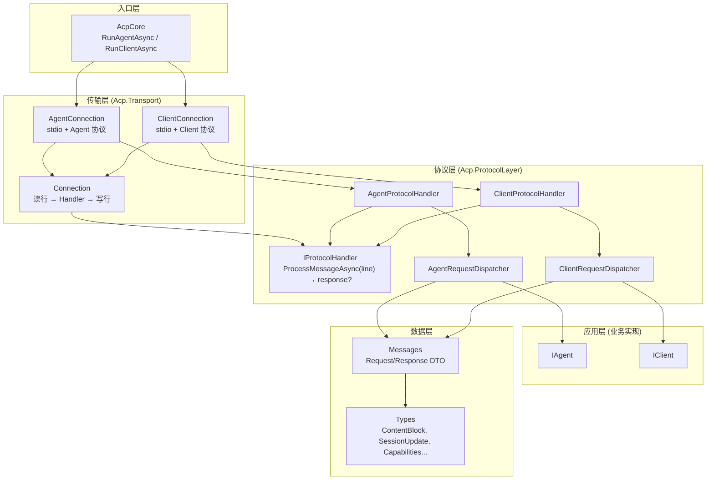
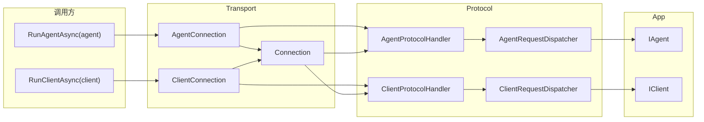
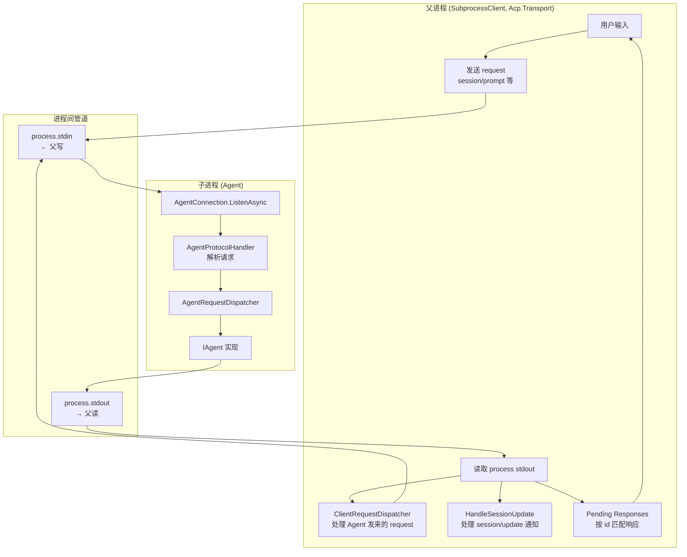

# ACP .NET 项目架构说明

本文档描述 **Acp**（Agent Communication Protocol）.NET 实现的整体架构、分层、组件关系与数据流。

---

## 1. 项目概览

| 项目 | 说明 |
|------|------|
| **协议** | ACP，基于 JSON-RPC 2.0，通过「一行一条消息」在 Client 与 Agent 之间通信。 |
| **传输** | 默认 stdio（标准输入/输出）；协议层与传输层解耦，可扩展为 WebSocket、TCP 等。 |
| **角色** | **Client**：发起会话、发 prompt、提供文件/终端等能力；**Agent**：处理 prompt、调用 Client 能力、流式推送 session 更新。 |

---

## 2. 架构总览图



---

## 3. 分层说明

### 3.1 入口层

| 组件 | 文件 | 职责 |
|------|------|------|
| **AcpCore** | `Transport/AcpCore.cs` | 静态入口。`RunAgentAsync(IAgent, input?, output?)` / `RunClientAsync(IClient, input?, output?)` 创建对应 Connection 并调用 `ListenAsync`，默认使用 Console 标准流。 |

### 3.2 传输层（Acp.Transport）

传输层只负责「按行读写」，不解析 JSON-RPC 内容。

| 组件 | 文件 | 职责 |
|------|------|------|
| **Connection** | `Transport/Connection.cs` | 持有 `TextReader`、`TextWriter`、`IProtocolHandler`。`ListenAsync` 循环：读一行 → `handler.ProcessMessageAsync(line)` → 若返回非 null 则写回并 Flush。提供 `SendRequestAsync` / `SendNotificationAsync` 供主动发请求（如子进程父端）。 |
| **AgentConnection** | `Transport/AgentConnection.cs` | 构造 `AgentProtocolHandler(agent)` 并传给 `Connection`；暴露 `Dispatcher` 用于注册自定义 Agent 方法。 |
| **ClientConnection** | `Transport/ClientConnection.cs` | 构造 `ClientProtocolHandler(client)` 并传给 `Connection`；暴露 `RegisterHandler` 用于注册自定义 Client 方法。 |
| **SubprocessClient** | `Transport/SubprocessClient.cs` | 子进程模式基础实现：继承 `Client` 并实现 `IAgentSessionClient`。`StartAsync` 启动子进程、创建 `ClientConnection` 并后台 `ListenAsync`；暴露 Initialize、SessionNew、SessionPrompt 等强类型 API；不包含 REPL/控制台逻辑。 |
| **SubprocessClientOptions** | `Transport/SubprocessClientOptions.cs` | 可选 Stderr 输出、ProcessStartInfo 等，供 `SubprocessClient` 构造时使用。 |

### 3.3 协议层（Acp.ProtocolLayer）

协议层负责 JSON-RPC 的解析、方法分发与响应/错误序列化，与具体传输无关。

| 组件 | 文件 | 职责 |
|------|------|------|
| **IProtocolHandler** | `Protocol/IProtocolHandler.cs` | 接口：`Task<string?> ProcessMessageAsync(string requestLine, CancellationToken)`。返回要写回的一行响应，或 null（通知无需响应）。 |
| **AgentProtocolHandler** | `Protocol/AgentProtocolHandler.cs` | 实现 `IProtocolHandler`。解析 method/id/params → 调用 `AgentRequestDispatcher` → 序列化 result 或 JSON-RPC error。 |
| **ClientProtocolHandler** | `Protocol/ClientProtocolHandler.cs` | 同上，面向 Client 侧；内部使用 `ClientRequestDispatcher`，暴露 `RegisterHandler`。 |
| **AgentRequestDispatcher** | `Protocol/AgentRequestDispatcher.cs` | 按 method 调用 `IAgent` 对应方法；支持 `Register(method, AgentMethodHandler)` 扩展。 |
| **ClientRequestDispatcher** | `Protocol/ClientRequestDispatcher.cs` | 按 method 调用 `IClient` 对应方法；支持 `Register(method, ClientMethodHandler)` 扩展。 |

### 3.4 应用层（接口与默认实现）

| 组件 | 文件 | 职责 |
|------|------|------|
| **IAgent** | `Interfaces/IAgent.cs` | Agent 侧协议方法：Initialize、session/new、session/load、session/prompt、session/cancel 等 + ExtMethodAsync。 |
| **IClient** | `Interfaces/IClient.cs` | Client 侧协议方法：SessionUpdate、fs/read_text_file、fs/write_text_file、terminal/*、request_permission 等 + ExtMethodAsync。 |
| **IAgentSessionClient** | `Interfaces/IAgentSessionClient.cs` | Client 调用 Agent 的强类型接口（Initialize、SessionNew、SessionPrompt 等）；由 `SubprocessClient` 实现，便于替换为其他传输（如 WebSocket）或测试 Mock。 |
| **Agent** | `Interfaces/Agent.cs` | `IAgent` 的默认实现（可覆写）；含 Echo 示例逻辑。 |
| **Client** | `Interfaces/Client.cs` | `IClient` 的默认实现（可覆写）；含文件、终端等占位实现。 |

### 3.5 数据层（Messages + Types）

| 区域 | 文件 | 职责 |
|------|------|------|
| **Messages** | `Messages/Requests.cs`、`Messages/ClientRequests.cs` | 所有 JSON-RPC 请求/响应的 DTO（InitializeRequest/Response、PromptRequest/Response、ReadTextFileRequest 等）。 |
| **Types** | `Types/ContentBlocks.cs`、`SessionUpdates.cs`、`Capabilities.cs`、`RequestId.cs` | 协议共用类型：ContentBlock、SessionUpdate、Capabilities、RequestId 等。 |
| **Core** | `Core/Protocol.cs` | 协议版本常量。 |
| **Exceptions** | `Exceptions/AcpExceptions.cs` | ACP 相关异常类型。 |
| **Helpers** | `Helpers/Builders.cs` | ContentBlock、ToolCall、Permission 等构建辅助方法。 |

---

## 4. 组件关系图



---

## 5. 数据流：Client 调用 Agent（stdio 模式）

```mermaid
sequenceDiagram
    participant U as 用户/调用方
    participant Conn as Connection
    participant Handler as IProtocolHandler
    participant Disp as RequestDispatcher
    participant App as IAgent / IClient

    U->>Conn: ListenAsync() 或 SendRequest(method, params)
    loop 每行
        Conn->>Conn: ReadLine()
        Conn->>Handler: ProcessMessageAsync(line)
        Handler->>Handler: 解析 method, id, params
        Handler->>Disp: DispatchAsync(method, params)
        Disp->>App: 调用 IAgent/IClient 方法
        App-->>Disp: result
        Disp-->>Handler: result
        Handler-->>Conn: responseLine (或 null)
        alt 有 response
            Conn->>Conn: WriteLine(response); Flush()
        end
    end
```

---

## 6. 数据流：子进程模式（父进程 Client + 子进程 Agent）



- 父进程向子进程 **stdin** 写 JSON-RPC 请求，从 **stdout** 读响应或通知。
- 父进程根据读到的内容：带 **id** 的视为对己方请求的 **response**（放入 Pending）；带 **method + id** 的视为 **Agent 发来的 request**，用 `ClientRequestDispatcher` 调用自身后把响应写回 stdin；带 **method 无 id** 的视为 **notification**（如 session/update），由 `HandleSessionUpdateAsync` 等处理。

---

### 6.1 子进程模式基础实现

- **基类**：`Acp.Transport.SubprocessClient`，继承 `Client` 并实现 `IAgentSessionClient`。提供 `StartAsync(CancellationToken)`（启动子进程与 `ClientConnection.ListenAsync`）、`StopAsync()`、以及 Initialize、SessionNew、SessionPrompt 等强类型方法；不包含 REPL、控制台或自动 initialize/session-new。
- **可替代性**：调用方依赖 `IAgentSessionClient` 即可获得完整 Agent 调用能力，可替换为其他实现（如 WebSocket Client）。
- **示例**：`examples/Acp.ConsoleTest` 中的 `SubprocessConsoleClient` 继承 `SubprocessClient`，覆写 `SessionUpdateAsync`（ANSI 输出）、实现 `RunAsync`（StartAsync → Initialize → SessionNew → 控制台主循环 /help、/quit、/new、/sessions、/read、/write），提供完整可用的控制台 REPL 体验。

---

## 7. 目录结构

```
dotnet-acp/
├── src/Acp/
│   ├── Core/
│   │   └── Protocol.cs                 # 协议版本常量
│   ├── Exceptions/
│   │   └── AcpExceptions.cs            # 异常类型
│   ├── Helpers/
│   │   └── Builders.cs                 # 构建辅助
│   ├── Interfaces/
│   │   ├── IAgent.cs
│   │   ├── IClient.cs
│   │   ├── IAgentSessionClient.cs      # Client 调用 Agent 的接口
│   │   ├── Agent.cs                    # IAgent 默认实现
│   │   └── Client.cs                   # IClient 默认实现
│   ├── Messages/
│   │   ├── Requests.cs                 # Agent 侧请求/响应 DTO
│   │   └── ClientRequests.cs           # Client 侧请求/响应 DTO
│   ├── Protocol/                       # 协议层 (Acp.ProtocolLayer)
│   │   ├── IProtocolHandler.cs
│   │   ├── AgentProtocolHandler.cs
│   │   ├── ClientProtocolHandler.cs
│   │   ├── AgentRequestDispatcher.cs
│   │   └── ClientRequestDispatcher.cs
│   ├── Transport/                      # 传输层
│   │   ├── AcpCore.cs                  # 入口
│   │   ├── Connection.cs
│   │   ├── AgentConnection.cs
│   │   ├── ClientConnection.cs
│   │   ├── SubprocessClient.cs         # 子进程 Client 基础实现
│   │   └── SubprocessClientOptions.cs
│   └── Types/
│       ├── ContentBlocks.cs
│       ├── SessionUpdates.cs
│       ├── Capabilities.cs
│       └── RequestId.cs
├── examples/Acp.ConsoleTest/
│   ├── Program.cs                      # 示例：SubprocessConsoleClient、EchoAgent、测试
│   └── SubprocessConsoleClient.cs      # 控制台 REPL：继承 SubprocessClient，ANSI + /commands
└── docs/
    ├── ARCHITECTURE.md                 # 本文档（架构图与说明）
    └── ARCHITECTURE-REVIEW.md          # 历史审查与改进记录
```

---

## 8. 设计要点

| 要点 | 说明 |
|------|------|
| **协议与传输解耦** | `Connection` 只依赖 `IProtocolHandler`（入参一行、出参一行）。更换传输（如 WebSocket）时，只需新写「读行/写行」的包装，复用同一套 Protocol 实现。 |
| **可扩展方法** | Agent 侧通过 `AgentConnection.Dispatcher.Register(method, handler)`；Client 侧通过 `ClientConnection.RegisterHandler(method, handler)`。未注册的 method 走 `ExtMethodAsync`。 |
| **错误边界** | 协议层将异常转为 JSON-RPC error 行并返回，避免未捕获异常导致对端一直等待。 |
| **子进程对称** | 父进程既向子进程发 request，也接收子进程的 request 与 notification；父进程使用同一套 `ClientRequestDispatcher` 处理 Agent 发来的 request 并回写响应。 |

---

## 9. 纯文本架构图（无 Mermaid 时可用）

```
┌─────────────────────────────────────────────────────────────────────────────┐
│                              入口层                                           │
│  AcpCore: RunAgentAsync(IAgent) / RunClientAsync(IClient)                      │
└───────────────────────────────────┬─────────────────────────────────────────┘
                                    │
┌───────────────────────────────────▼─────────────────────────────────────────┐
│                              传输层 (Transport)                                │
│  AgentConnection / ClientConnection  →  Connection                             │
│  Connection: ReadLine → IProtocolHandler.ProcessMessageAsync(line) → WriteLine  │
└───────────────────────────────────┬─────────────────────────────────────────┘
                                    │
┌───────────────────────────────────▼─────────────────────────────────────────┐
│                            协议层 (ProtocolLayer)                             │
│  IProtocolHandler ← AgentProtocolHandler / ClientProtocolHandler              │
│       ↓                      ↓                                                │
│  AgentRequestDispatcher    ClientRequestDispatcher  (按 method 分发)           │
└───────────────────────────────────┬─────────────────────────────────────────┘
                                    │
┌───────────────────────────────────▼─────────────────────────────────────────┐
│                            应用层 (业务实现)                                   │
│  IAgent (Initialize, session/new, session/prompt, ...)                        │
│  IClient (SessionUpdate, fs/read_text_file, terminal/*, ...)                  │
└───────────────────────────────────┬─────────────────────────────────────────┘
                                    │
┌───────────────────────────────────▼─────────────────────────────────────────┐
│                            数据层                                              │
│  Messages (Requests.cs, ClientRequests.cs)  +  Types (ContentBlocks, ...)     │
└─────────────────────────────────────────────────────────────────────────────┘
```

---

## 10. 图例与 Mermaid 使用说明

- 文档中的图使用 **Mermaid** 语法，可在支持 Mermaid 的环境（如 GitHub、GitLab、VS Code 插件、Typora 等）中直接渲染。
- 若需导出为 PNG/SVG，可使用 [Mermaid Live Editor](https://mermaid.live/) 或 `@mermaid-js/mermaid-cli`。
